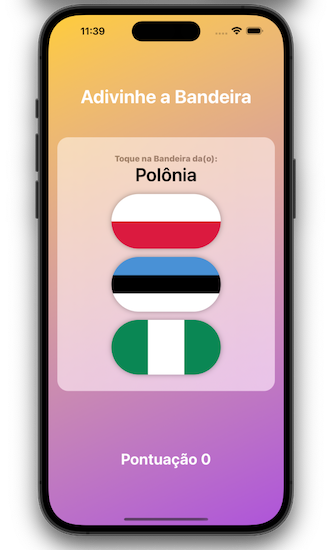

## Our Goal

To make a game that shows the punctuation of the score of a player in the app alerts.

#

## What was created

My first correct/incorrect game in SwiftUI with a beautiful interface and easy understanding that shows the player punctuation end promotes our ability to improve the knowlege of the flags and countries of the world.

#

## What I learn

- How to property use @State variables.
- How to property use alerts.
- Advanced functions and methods.
- Variable scope.
- The ViewController lifecycle.
- Error handling in Swift.
- Code refactoring.
- Basic debugging.

#

> This is a project made from The [100DaysOfSwiftUI](https://www.hackingwithswift.com/100/swiftui), check my portfolio at [andreporto.vercel.app](https://andreporto.vercel.app)
